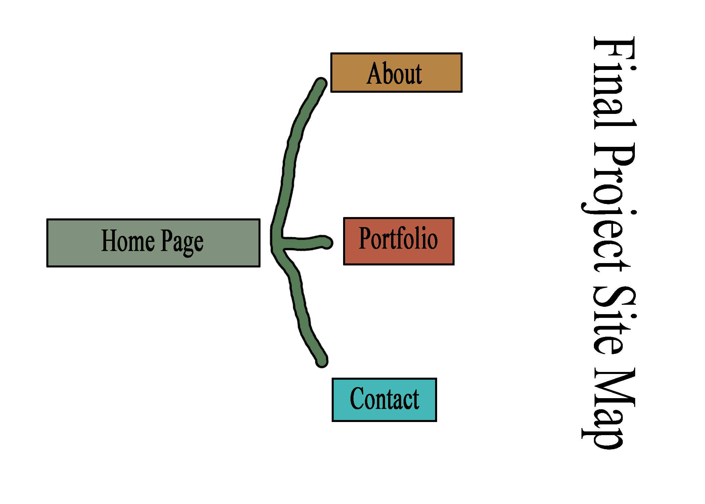
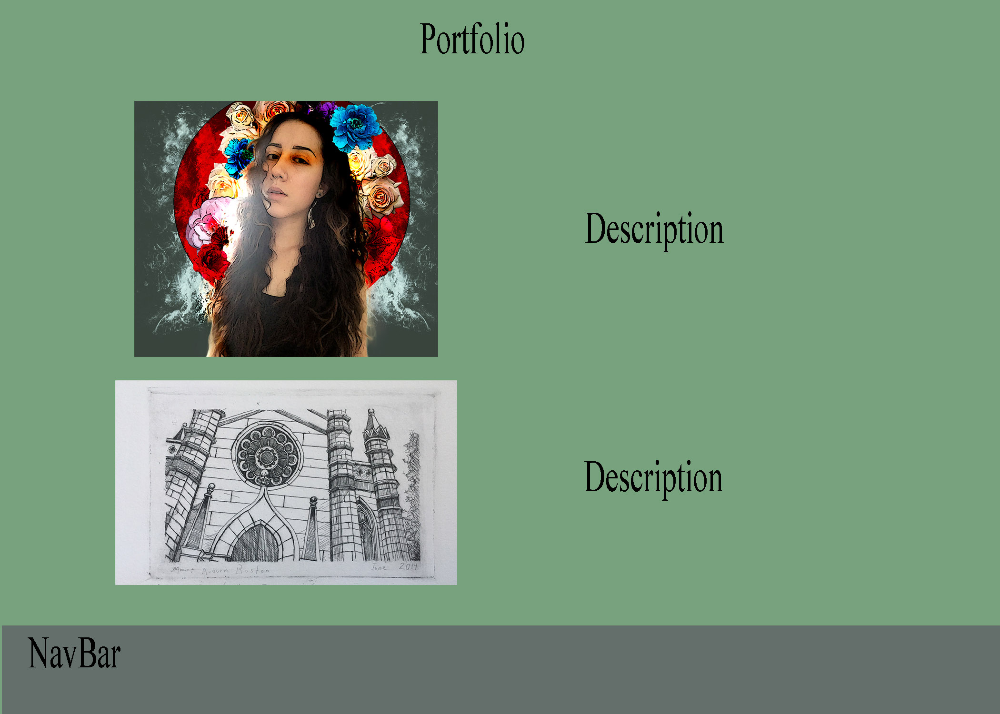
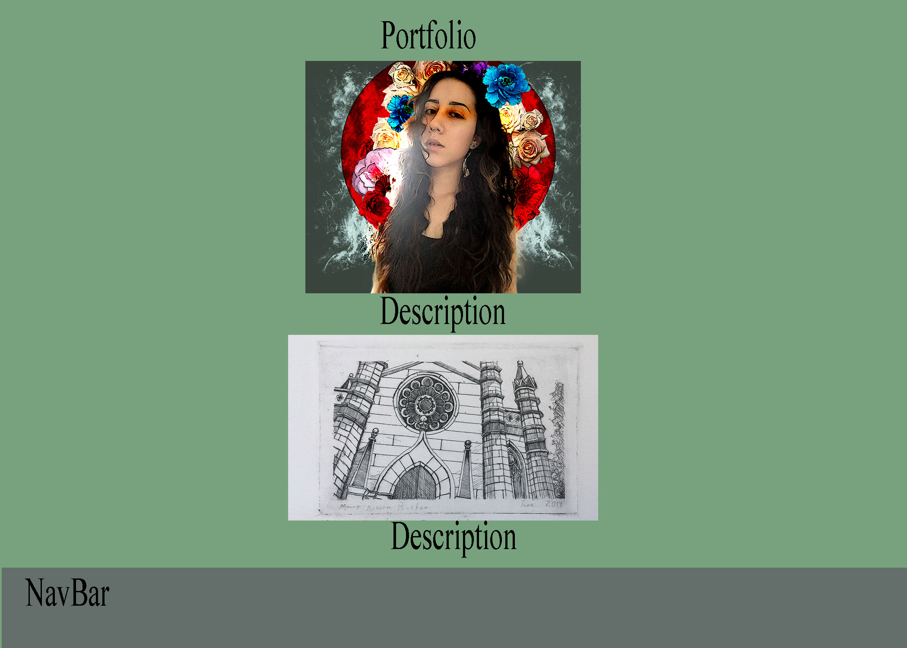

# 341-final
# README
______
# 1)Development Process
I spent quite a bit of time in development for this project, and think I did a fairly good job with pre-planning to help avoid issues
during the later stages.  Starting out, I made multiple wire frames and a site map in photoshop, which are included at the end of this
section. The wire frames were very helpful as I was able to place images exactly where I wanted them and see the effects before even 
beginning coding.  During the development phase I also did quite a bit of handwritten doccumentation, including a list of all image and 
file names that I kept right next to my computer while working.  This helped me significantly as I had issues in past projects with 
images or links not working because of small issues like capitilized letters that I wasted alot of time finding and fixing.  I also 
planned out my file organization and how I was going to organize my CSS.  
For this project I used multiple style sheets for each doccument which I have not done before.  I also did this due to past issues; many
of my css files in the past were too long and not organized and made it difficult to find and fix issues I was looking for.  This time
I made seperate sheets for specific effects and elements such as parallax, my navbar and forms.  This change saved me a lot of time and
helped me stay organized and avoid frusturation.

# 2) Content
For this project I choose to keep the content and layout of the site fairly simple.  I included a home page, portfolio gallery, contact page and about.  I chose to keep the content simple so that I would be able to focus on the design of my site.  

# 3) Design Elements

I included parallax design, images, forms, boxes, menus, RWD and other design elements in my site. As usual, I struggled a fair bit wiith some of these elements.  The RWD was particularilly difficult for me, I ran out of time and am not happy with the way my site looks on mobile devices.  The main issue that I had was making the background images scale down with the page.  The images were also a bit of an issue with me, I originally wanted my portfolio page to have the images on the left side and the descriptions next to each image on the right side of the page but I wasn't able to format it in a way that looked good so I ended up just centering all of them.  

Overall I am very happy with how my site looks and functions on a computer, I think that even though the design is a bit simple it looks very professional and clean.  I wish I had been able to make the mobile version better but overall I am pleased with the outcome.    

